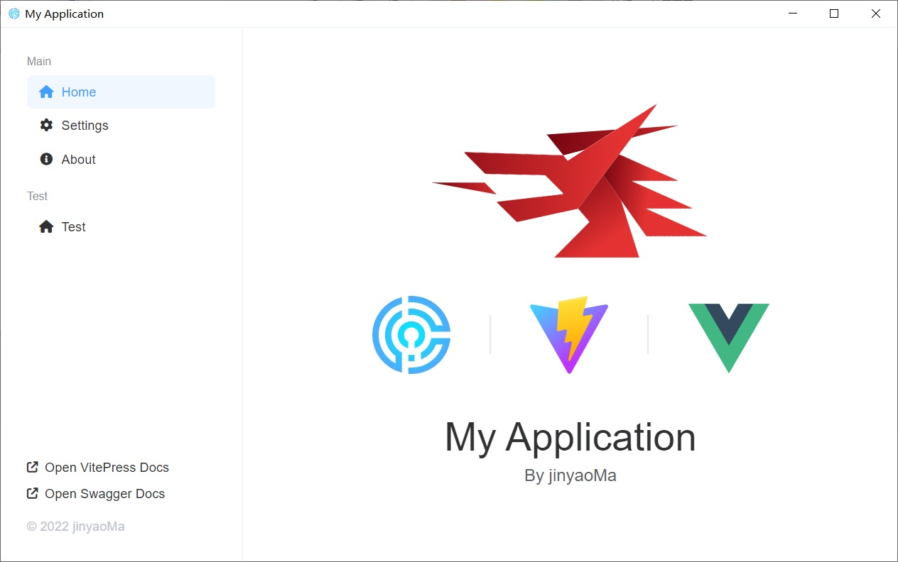
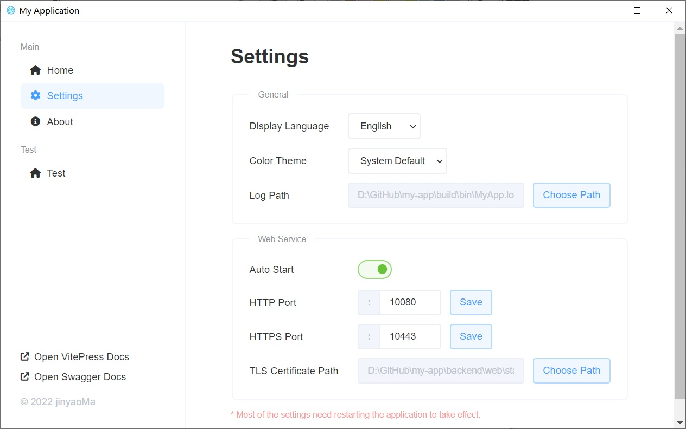

# My Application (my-app)

My Application is a continuously updated personal service collection.

## Starter Code Preview

> You can find all preview screenshots [here](./screenshots/).

<p align="center">


</p>

## Technologies

| Technology  | Role                                                  | Sources                                 |
| :---------- | :---------------------------------------------------- | :-------------------------------------- |
| Go          | Backend programming language                          | https://pkg.go.dev/std                  |
| TypeScript  | Frontend programming language                         | https://typescriptlang.org/             |
| Sass/Scss   | Frontend CSS extension language                       | https://sass-lang.com/dart-sass         |
| Vite        | Next Generation Frontend Tooling                      | https://vitejs.dev/                     |
| Vue 3       | Progressive JavaScript Framework                      | https://vuejs.org/                      |
| Wails v2    | Build cross-platform desktop applications using Go    | https://wails.io/                       |
| UPX         | Ultimate packer for executables                       | https://upx.github.io/                  |
| Systray     | A cross platfrom system tray using Go                 | https://github.com/getlantern/systray   |
| Gin         | A HTTP web framework using Go                         | https://gin-gonic.com/                  |
| Gin Swagger | Gin middleware for API documentation with Swagger 2.0 | https://github.com/swaggo/gin-swagger   |
| Swaggo      | Converts Go annotations to Swagger Documentation 2.0  | https://github.com/swaggo/swag          |
| Air         | Live reload and test for API service                  | https://github.com/cosmtrek/air         |
| GORM        | ORM library for Go                                    | https://gorm.io/                        |
| SQLite      | GORM sqlite driver                                    | https://github.com/go-gorm/sqlite       |
| SVG To Font | Generator of fonts from SVG icons                     | https://github.com/jaywcjlove/svgtofont |

## Setup

Prepare and install environment for development in Window 10/11?

- Git v2.37+, https://git-scm.com/
- Go v1.19+, https://go.dev/
- Node.js v16+, https://nodejs.org/
- PNPM v7+, https://pnpm.io/
- VS Code v1.71+ with GCC, https://code.visualstudio.com/docs/cpp/config-mingw
- WebView2 v104+, https://developer.microsoft.com/en-us/microsoft-edge/webview2/

> Setup VS Code by installing recommended extensions. To do this, enter in `@recommended` while searching for extensions.

> Run command `go env -w CGO_ENABLED=1` to prepare for _CGO_ enabled packages

> Run command `pnpm install` at project root directory to setup.

## NPM Scripts

```shell
$ pnpm wails:dev # run wails in development mode
$ pnpm wails:build # build wails application
$ pnpm upx:compress # compress the generated executable by `wails:build` script
$ pnpm air:dev # test web service individually
$ pnpm swag:docs # generate/update swagger docs
$ pnpm docs:dev # test vitepress docs individually
$ pnpm docs:build # generate/update vitepress docs
$ pnpm icons:build # build frontend/packages/icons
$ pnpm design:build # build frontend/packages/design
$ pnpm <[install|preinstall]:[task]> # install/preinstall scripts trigger during project setup
```

## Directory Structure

```yaml
.
├── .tools # auto-generated, development tools/CLIs
├── .vscode # extensions for VS Code
├── air # sources related to air hot reload tool
│   ├── bin # auto-generated, try script `air:dev`
│   ├── .air.toml # air config
│   └── main.go # run web service individually w/o wails and tray
├── backend # sources related to backend code
│   ├── app # app module, business layer
│   │   ├── app.go # contain global state and resources
│   │   ├── config.go # load application options from database
│   │   ├── env.go # load os environment variable
│   │   ├── logger.go # setup loggers
│   ├── model # model module, data layer
│   │   ├── model.go # database setup
│   │   └── my_option.go # define application options for app config storage
│   ├── pkg # pkg module, cross cutting
│   │   ├── i18n # manage locale/translation strings for backend
│   │   ├── log # define loggers for backend
│   │   └── utils # helper functions
│   ├── service # service module, business layer
│   │   ├── service.go # initialize provided services
│   │   └── settings.go # functions about configure application
│   ├── tray # tray module, presentations & services layer
│   │   ├── icons # tray icons
│   │   ├── menus # tray menus
│   │   ├── listeners.go # listen to tray menu-item click events
│   │   └── tray.go # system tray
│   └── web # web module, presentations & services layer
│       ├── api # API services
│       ├── auth # Auth services
│       ├── middleware # custom gin middlewares
│       ├── static # static websites and sources
│       │   ├── certs # auto-generated for localhost TLS, try script `install:certs`
│       │   ├── docs # auto-generated, try script `docs:build`
│       │   ├── swagger # auto-generated, try script `swag:docs`
│       │   ├── static.go # manage static sources
│       │   └── # ...
│       ├── air.go # special function for air to run web service individually
│       ├── router.go # entry point of swaggo docs generator, manage routes for API
│       └── web.go # web service
├── build # sources to use during wails build process
│   ├── bin # auto-generated, try script `wails:dev` or `wails:build`
│   └── # ...
├── diagrams # diagrams about 4+1 view model
├── docs # vitepress documentation
├── frontend # sources related to frontend code, workplace managed by PNPM
│   ├── packages # frontend components, icons, etc.
│   ├── src # wails frontend sources
│   │   ├── vite-env.d.ts # put go struct associated types into it
│   │   └── # ...
│   └── # ...
├── main.go # wails main application, presentations & services layer
├── wails_life_cycle.go # wails life cycle
├── wails.json # wails CLI config
└── # ...
```

## Development View


